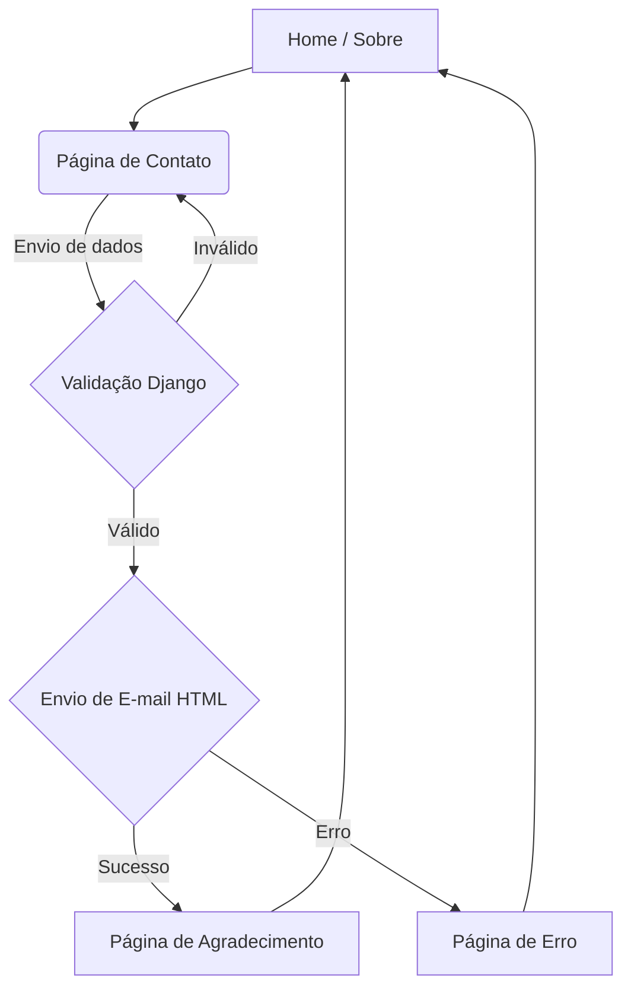

# Vitrine Digital - ACJR Engenharia Mecânica ⚙️

Este projeto é um site institucional e vitrine virtual desenvolvido para a empresa ACRJ Engenharia Mecânica. O objetivo principal é centralizar a presença digital da marca, apresentando seus serviços de forma clara e facilitando o contato direto com clientes em potencial.



## 📋 Sobre o Projeto

Diferente de uma página estática simples, esta aplicação utiliza Django para gerenciar a lógica de envio de e-mails e renderização dinâmica, garantindo uma experiência profissional tanto para o usuário quanto para o proprietário da empresa.

## 🛠️ Tecnologias e Ferramentas

* **Backend**: <a href="https://www.python.org/about/" target="_blank">Python 3</a> & <a href="https://www.djangoproject.com/" target="_blank">Django</a> (MVT Architecture).

* **Frontend**: <a href="https://developer.mozilla.org/pt-BR/docs/Web/JavaScript" target="_blank">JavaScript</a> & <a href="https://tailwindcss.com/" target="_blank">Tailwind CSS</a> (Design Responsivo e Moderno).

* **Comunicação**: Utilização da biblioteca <a href="https://docs.djangoproject.com/en/6.0/topics/email/" target="_blank">django.core.mail</a> com EmailMultiAlternatives.

* Estilização: Mobile-first approach para total compatibilidade com smartphones.

## 💻 Funcionalidades Principais

* **Single Page Experience (Home)**: Seção "Sobre" integrada à vitrine de serviços para uma navegação fluida.

* **Fluxo de Contato Automatizado**:
    * Formulário com validação de dados.
    * Disparo automático de e-mail formatado em HTML para o administrador.
    * Redirecionamento inteligente para página de agradecimento (Success Page).

* **Componentização**: Header e Footer consistentes em todas as rotas da aplicação.

* **UI/UX**: Interface limpa e otimizada construída com Tailwind CSS.

## 🏠 Arquitetura de Templates e Organização

### 📂 Árvore de Diretórios

```text
SITE DE CONTATO/
├── contact_site/           # Aplicação principal (Lógica e Core)
│   ├── templates/          # Gestão modular de visualização
│   │   ├── emails/         # Templates para notificações SMTP (email.html)
│   │   ├── errors/         # Feedback visual para exceções e falhas (error.html)
│   │   ├── global/         # Template mestre (base.html)
│   │   ├── partials/       # Componentes reutilizáveis (header.html, footer.html)
│   │   ├── Home.html       # Página institucional e vitrine
│   │   ├── contato.html    # Interface do formulário de contato
│   │   └── obrigado.html   # Feedback de sucesso pós-envio
│   ├── form.py             # Definição e validação do ContactForm
│   ├── urls.py             # Mapeamento de rotas da aplicação
│   └── views.py            # Orquestração: Renderização, tratamento de erros e e-mails
├── project/                # Configurações de ambiente do Django
├── utils/                  # Recursos auxiliares (requirements.txt, tailwind.config.js)
├── .env                    # Variáveis de ambiente sensíveis (segurança)
└── manage.py               # Utilitário de linha de comando do Django
```
